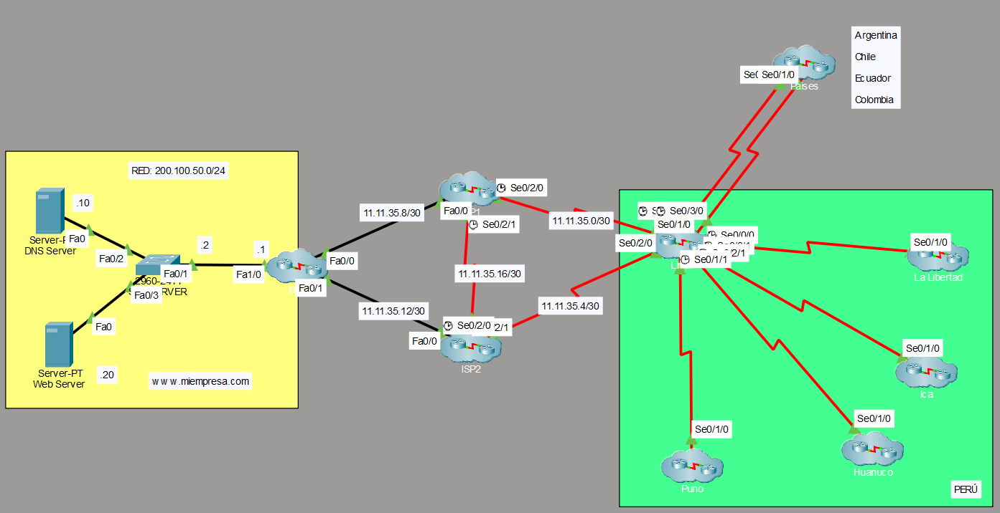

# Trabajo final de Redes y Comunicaciones de Datos 

## Resúmenes

- [Spanning Tree Protocol y como agregar una nueva VLAN](docs/spanning-tree.md)
- [Protocolos punto a punto](docs/protocol-point-to-point.md)
- [Enrutamiento estático y dinámico](docs/routing-summary.md)
- [VPN Site-to-Site](docs/vpn-site-to-site.md)
- [Servicios](docs/services-summary.md)
- [Políticas de seguridad](docs/acl-summary.md)

