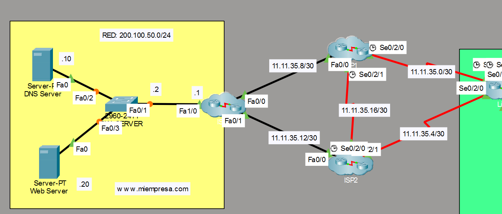

# INFORME — ENRUTAMIENTO
## Proyecto MIEMPRESA

---

## 1. RESUMEN EJECUTIVO

La red MIEMPRESA combina **dos estrategias de enrutamiento complementarias**:

- **Enrutamiento dinámico (RIPv2)** para toda la red interna corporativa
  (Perú + 4 países internacionales), garantizando convergencia automática.
- **Enrutamiento estático** limitado exclusivamente al egreso a Internet
  y la infraestructura de los ISPs (red pública).

### Principio de diseño
La red interna usa dinámico por escalabilidad y auto-recuperación; la
frontera con Internet usa estático por control y previsibilidad del egreso.

---

## 2. ENRUTAMIENTO DINÁMICO — RIPv2

### 2.1 Alcance
RIPv2 corre en **10 dispositivos internos**:
- 5 routers de Perú (Lima + Libertad, Ica, Huánuco, Puno)
- 5 switches multicapa CORE (uno por sede)
- 4 routers internacionales (Quito, Bogotá, SCH, BA)

### 2.2 Configuración base en cada dispositivo

```cisco
router rip
 version 2
 no auto-summary
 network 10.0.0.0
```

- **version 2**: soporta VLSM y máscaras de longitud variable (indispensable
  para el direccionamiento jerárquico /22, /25, /26, /27, /28).
- **no auto-summary**: desactiva el resumen automático a clase A, permitiendo
  propagar las subredes exactas.
- **network 10.0.0.0**: activa RIP en todas las interfaces del rango 10.x.x.x.

### 2.3 Ruta por defecto propagada (ROUTER_LIMA)

ROUTER_LIMA inyecta la ruta default en el dominio RIP para que todas las
sedes aprendan la salida a Internet dinámicamente:

```cisco
router rip
 default-information originate
```

Esto propaga `0.0.0.0/0` (R*) a los 5 COREs y a los 4 países en cascada.

### 2.4 Routers internacionales — passive-interface

Los routers de país usan control de interfaces para enviar updates solo
por los enlaces WAN correctos:

```cisco
router rip
 version 2
 no auto-summary
 network 10.0.0.0
 passive-interface default
 no passive-interface Serial0/1/0
 no passive-interface Serial0/2/0
```

### 2.5 Topología de propagación

```
                    Bogotá
                      |
                    Quito
                      |
Libertad ---\         |         /--- Ica
             \        |        /
Huánuco ------ ROUTER_LIMA (hub) ---- Puno
             /        |        \
            /         |         \
                    SCH
                      |
                     BA
```

Lima es el punto central (hub). Las dos ramas internacionales
(Ecuador/Colombia y Chile/Argentina) solo se comunican a través de Lima.

### 2.6 Cuenta de saltos (validación del límite RIP)

RIP soporta máximo 15 saltos. El camino más largo:
`BA → SCH → Lima → ISP1 → ISP3 → Site` = ~5 saltos internos.
Amplio margen; sin riesgo de superar el límite.

---

## 3. ENRUTAMIENTO ESTÁTICO

### 3.1 Alcance
El estático se limita a **3 usos específicos**, todos en la frontera pública:
- Egreso a Internet (default) en ROUTER_LIMA con failover dual-ISP
- Infraestructura de ISPs (ISP1, ISP2, ISP3)
- Ruta de retorno para la VPN site-to-site (ISP3)



### 3.2 ROUTER_LIMA — Egreso a Internet con failover

```cisco
ip route 0.0.0.0 0.0.0.0 11.11.35.1 1
ip route 0.0.0.0 0.0.0.0 11.11.35.5 10
```

- **Default primaria** vía ISP1 (`11.11.35.1`), distancia administrativa 1.
- **Default flotante** vía ISP2 (`11.11.35.5`), AD 10.

Mecanismo de failover: la ruta con menor AD (ISP1) es la activa. Si el
enlace a ISP1 cae, la ruta flotante (ISP2) toma el relevo automáticamente.

### 3.3 ISP3 — Ruta de retorno para VPN site-to-site

```cisco
ip route 10.192.0.0 255.255.0.0 11.11.35.9
```

Permite que el tráfico de retorno del túnel IPSec (desde los servidores
públicos hacia la red corporativa) encuentre camino. Sin esta ruta, el
túnel sube pero los paquetes de vuelta no llegan a los hosts internos.

### 3.4 Rutas en ISPs (failover de red pública)

Los tres ISPs tienen rutas estáticas para el failover bidireccional entre
ellos y hacia el sitio público. Ejemplo del patrón:

```cisco
! ISP1
ip route 200.100.50.0 255.255.255.0 11.11.35.18 10
! ISP2
ip route 200.100.50.0 255.255.255.0 11.11.35.17 10
```

---

## 4. INTERACCIÓN ESTÁTICO + DINÁMICO

```
[Hosts internos] --- RIPv2 --- [ROUTER_LIMA] --- ESTÁTICO --- [ISPs/Internet]
                                     |
                          default-information originate
                                     |
                          (RIP propaga 0.0.0.0/0 a todas las sedes)
```

- El **estático** define la salida a Internet en el punto de frontera (Lima).
- El comando `default-information originate` **traduce** esa ruta estática a
  una ruta dinámica que RIP distribuye a toda la red interna.
- Resultado: las sedes no necesitan rutas estáticas propias; aprenden la
  salida a Internet por RIP.

---

## 5. MIGRACIÓN DE ESTÁTICAS A DINÁMICAS

En la evolución del proyecto, las rutas estáticas CORE→Router fueron
**migradas a RIPv2**. Solo quedaron como estáticas las de la frontera
pública (egreso Internet + infraestructura ISP + retorno VPN).

**Justificación:** el enrutamiento dinámico intra-corporativo reduce la
carga administrativa (no hay que declarar cada subred manualmente) y provee
auto-recuperación ante fallos de enlace.

---

## 6. VERIFICACIÓN

### Comandos de validación

```cisco
show ip route rip              ! rutas aprendidas dinámicamente
show ip route 0.0.0.0          ! ruta default (estática en Lima, R* en sedes)
show ip protocols              ! estado de RIP: networks, passive, versión
show ip route static           ! rutas estáticas configuradas
```

### Verificación de la ruta default en las 5 sedes

En cada CORE debe aparecer:
```
R*    0.0.0.0/0 [120/x] via <IP-router-sede>
```

### Precaución operativa (lección del proyecto)

Al rebotar múltiples enlaces PPP simultáneamente (ej. cambio masivo de
autenticación), RIP reconverge y la ruta default puede expirar en los
COREs. Solución: reafirmar `default-information originate` en ROUTER_LIMA
y verificar `show ip route 0.0.0.0` en las 5 sedes.

**Regla:** migrar/modificar enlaces de a uno por vez, verificando
convergencia entre cada cambio, para no perder la propagación de la default.

---

## 7. SÍNTESIS

| Aspecto | Dinámico (RIPv2) | Estático |
|---------|------------------|----------|
| **Alcance** | Red interna (Perú + países) | Frontera pública (ISPs) |
| **Dispositivos** | 5 routers PE + 5 COREs + 4 intl | ROUTER_LIMA + 3 ISPs |
| **Propósito** | Convergencia auto intra-corp | Egreso Internet + VPN retorno |
| **Ventaja** | Auto-recuperación, escalable | Control y previsibilidad |
| **Failover** | Reconvergencia RIP | Rutas flotantes (AD) dual-ISP |